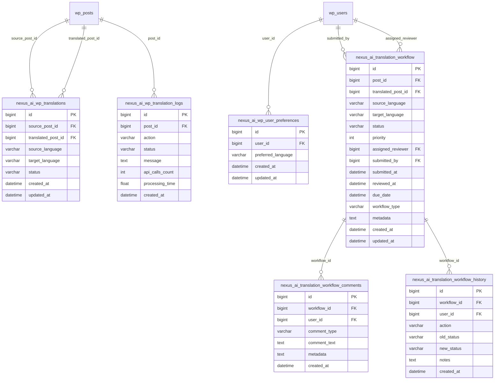
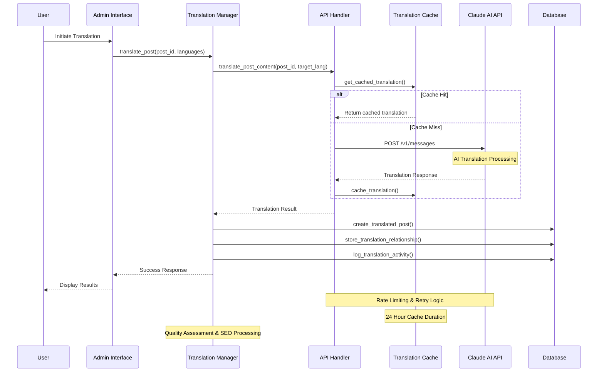
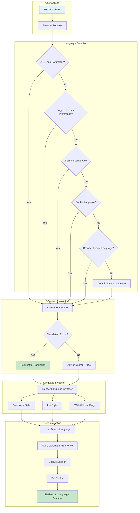
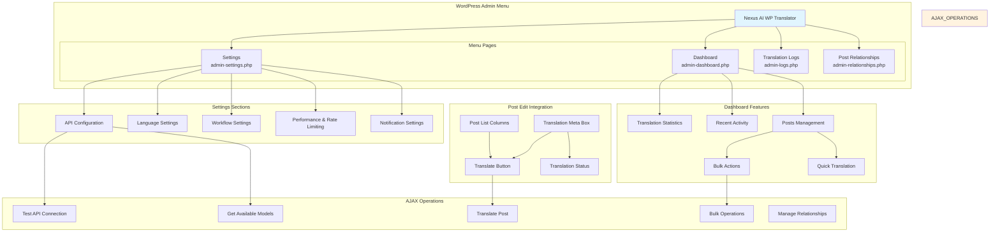
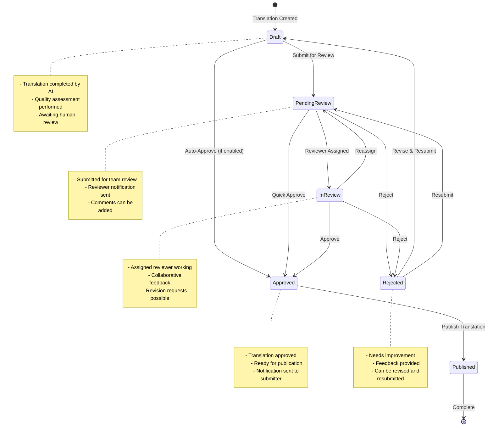
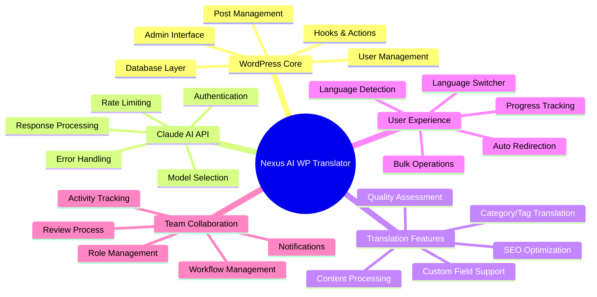

# Nexus AI WP Translator - Architectural Diagram

## Plugin Architecture Overview

```mermaid
graph TB
    subgraph "WordPress Environment"
        WP[WordPress Core]
        ADMIN[Admin Interface]
        FRONTEND[Frontend Interface]
        DB[(WordPress Database)]
    end

    subgraph "Plugin Core Components"
        MAIN[nexus-ai-wp-translator.php<br/>Main Plugin Controller]
        
        subgraph "Core Classes"
            TM[Translation Manager<br/>class-translation-manager.php]
            API[API Handler<br/>class-api-handler.php]
            DATABASE[Database<br/>class-database.php]
            ADMIN_CLASS[Admin<br/>class-admin.php]
            FRONTEND_CLASS[Frontend<br/>class-frontend.php]
            WORKFLOW[Workflow Manager<br/>class-workflow-manager.php]
        end

        subgraph "Feature Classes"
            SETTINGS[Settings<br/>class-settings.php]
            QA[Quality Assessor<br/>class-quality-assessor.php]
            SEO[SEO Optimizer<br/>class-seo-optimizer.php]
            SCHEDULER[Translation Scheduler<br/>class-translation-scheduler.php]
            ANALYTICS[Analytics<br/>class-analytics.php]
            MEMORY[Translation Memory<br/>class-translation-memory.php]
            CUSTOM[Custom Fields Translator<br/>class-custom-fields-translator.php]
            ERROR[Error Handler<br/>class-error-handler.php]
            TEMPLATES[Translation Templates<br/>class-translation-templates.php]
            SWITCHER[Language Switcher<br/>class-language-switcher.php]
            GUTENBERG[Gutenberg Block<br/>class-gutenberg-block.php]
        end
    end

    subgraph "External Services"
        CLAUDE[Claude AI API<br/>api.anthropic.com]
    end

    subgraph "Database Tables"
        TRANS_TABLE[nexus_ai_wp_translations<br/>Translation Relationships]
        LOGS_TABLE[nexus_ai_wp_translation_logs<br/>Activity Logs]
        PREFS_TABLE[nexus_ai_wp_user_preferences<br/>User Language Preferences]
        WORKFLOW_TABLE[nexus_ai_translation_workflow<br/>Workflow Items]
        COMMENTS_TABLE[nexus_ai_translation_workflow_comments<br/>Workflow Comments]
        HISTORY_TABLE[nexus_ai_translation_workflow_history<br/>Workflow History]
    end

    %% Core Dependencies
    MAIN --> TM
    MAIN --> API
    MAIN --> DATABASE
    MAIN --> ADMIN_CLASS
    MAIN --> FRONTEND_CLASS
    MAIN --> WORKFLOW

    %% Manager Dependencies
    TM --> API
    TM --> DATABASE
    TM --> QA
    TM --> SEO
    
    API --> CLAUDE
    API --> MEMORY
    API --> ERROR

    ADMIN_CLASS --> TM
    ADMIN_CLASS --> DATABASE
    ADMIN_CLASS --> API

    FRONTEND_CLASS --> DATABASE
    FRONTEND_CLASS --> SWITCHER

    WORKFLOW --> DATABASE

    %% Database Connections
    DATABASE --> TRANS_TABLE
    DATABASE --> LOGS_TABLE
    DATABASE --> PREFS_TABLE
    WORKFLOW --> WORKFLOW_TABLE
    WORKFLOW --> COMMENTS_TABLE
    WORKFLOW --> HISTORY_TABLE

    %% WordPress Integration
    ADMIN_CLASS --> ADMIN
    FRONTEND_CLASS --> FRONTEND
    DATABASE --> DB
    GUTENBERG --> WP

    %% Feature Dependencies
    TM --> SCHEDULER
    TM --> ANALYTICS
    TM --> CUSTOM
    TM --> TEMPLATES
    API --> SETTINGS

    style MAIN fill:#e1f5fe
    style CLAUDE fill:#ffecb3
    style DB fill:#f3e5f5
```

## Translation Workflow Process

```mermaid
flowchart TD
    START([User Initiates Translation])
    
    subgraph "Pre-Translation Validation"
        CHECK_API{API Key Valid?}
        CHECK_THROTTLE{Within Rate Limits?}
        CHECK_POST{Post Exists?}
        CHECK_LANG{Valid Target Languages?}
    end

    subgraph "Content Validation & Processing"
        VALIDATE_CONTENT{Content Not Empty?}
        SPLIT[Split Content into Blocks]
        VALIDATE_BLOCKS{Valid Blocks Found?}
        CACHE_CHECK{Check Translation Cache}
        PREP_CONTEXT[Prepare Translation Context]
    end

    subgraph "AI Translation"
        API_CALL[Claude API Request]
        PROCESS_RESPONSE[Process AI Response]
        VALIDATE_RESPONSE{Valid Translation Response?}
        FILTER_COMMENTS[Filter AI Comments/Apologies]
        LOG_INVALID[Log Invalid Response]
        QUALITY_CHECK[Quality Assessment]
        RETRY{Retry if Failed?}
    end

    subgraph "Content Creation"
        CREATE_POST[Create Translated Post]
        COPY_META[Copy Post Metadata]
        TRANSLATE_CATS[Translate Categories]
        TRANSLATE_TAGS[Translate Tags]
        SEO_META[Add SEO Metadata]
    end

    subgraph "Post-Processing"
        STORE_RELATIONSHIP[Store Translation Relationship]
        UPDATE_CACHE[Update Translation Cache]
        LOG_ACTIVITY[Log Translation Activity]
        QUALITY_STORE[Store Quality Assessment]
    end

    subgraph "Workflow Management (Optional)"
        WORKFLOW_CHECK{Workflow Enabled?}
        CREATE_WORKFLOW[Create Workflow Item]
        ASSIGN_REVIEWER[Assign Reviewer]
        NOTIFY_TEAM[Send Notifications]
    end

    subgraph "Completion"
        SUCCESS([Translation Complete])
        PUBLISH{Auto-Publish?}
        DRAFT[Save as Draft]
        LIVE[Publish Live]
    end

    START --> CHECK_API
    CHECK_API -->|No| ERROR1[Return API Error]
    CHECK_API -->|Yes| CHECK_THROTTLE
    CHECK_THROTTLE -->|No| ERROR2[Return Rate Limit Error]
    CHECK_THROTTLE -->|Yes| CHECK_POST
    CHECK_POST -->|No| ERROR3[Return Post Error]
    CHECK_POST -->|Yes| CHECK_LANG
    CHECK_LANG -->|No| ERROR4[Return Language Error]
    CHECK_LANG -->|Yes| VALIDATE_CONTENT
    
    VALIDATE_CONTENT -->|No| SKIP_EMPTY[Skip Empty Content - No API Call]
    VALIDATE_CONTENT -->|Yes| SPLIT
    SPLIT --> VALIDATE_BLOCKS
    VALIDATE_BLOCKS -->|No| SKIP_EMPTY
    VALIDATE_BLOCKS -->|Yes| CACHE_CHECK
    SKIP_EMPTY --> SUCCESS
    CACHE_CHECK -->|Hit| USE_CACHE[Use Cached Translation]
    CACHE_CHECK -->|Miss| PREP_CONTEXT
    PREP_CONTEXT --> API_CALL

    API_CALL --> PROCESS_RESPONSE
    PROCESS_RESPONSE --> VALIDATE_RESPONSE
    VALIDATE_RESPONSE -->|Invalid/Comments| LOG_INVALID
    VALIDATE_RESPONSE -->|Valid| FILTER_COMMENTS
    FILTER_COMMENTS --> QUALITY_CHECK
    LOG_INVALID --> RETRY
    QUALITY_CHECK --> RETRY
    RETRY -->|Yes| API_CALL
    RETRY -->|No| CREATE_POST

    USE_CACHE --> CREATE_POST

    CREATE_POST --> COPY_META
    COPY_META --> TRANSLATE_CATS
    TRANSLATE_CATS --> TRANSLATE_TAGS
    TRANSLATE_TAGS --> SEO_META
    SEO_META --> STORE_RELATIONSHIP

    STORE_RELATIONSHIP --> UPDATE_CACHE
    UPDATE_CACHE --> LOG_ACTIVITY
    LOG_ACTIVITY --> QUALITY_STORE
    QUALITY_STORE --> WORKFLOW_CHECK

    WORKFLOW_CHECK -->|Yes| CREATE_WORKFLOW
    WORKFLOW_CHECK -->|No| PUBLISH
    CREATE_WORKFLOW --> ASSIGN_REVIEWER
    ASSIGN_REVIEWER --> NOTIFY_TEAM
    NOTIFY_TEAM --> SUCCESS

    PUBLISH -->|Yes| LIVE
    PUBLISH -->|No| DRAFT
    DRAFT --> SUCCESS
    LIVE --> SUCCESS

    style START fill:#c8e6c9
    style SUCCESS fill:#c8e6c9
    style ERROR1 fill:#ffcdd2
    style ERROR2 fill:#ffcdd2
    style ERROR3 fill:#ffcdd2
    style ERROR4 fill:#ffcdd2
```

## Database Schema Relationships

## API Integration Flow

## Frontend Language Management

## Admin Interface Structure

## Team Workflow Process

## Key Integration Points

---

## Summary

This architectural diagram documents the complete structure of the Nexus AI WP Translator WordPress plugin, showing:

1. **Component Architecture** - How all classes and modules interact
2. **Translation Workflow** - Step-by-step process from initiation to completion
3. **Database Design** - Table relationships and data storage
4. **API Integration** - External service communication patterns
5. **Frontend Management** - User language handling and content routing
6. **Admin Interface** - Management tools and user interactions
7. **Team Workflow** - Collaborative review and approval processes

The plugin follows WordPress best practices with proper separation of concerns, secure AJAX handlers, and comprehensive error handling throughout the translation pipeline.
